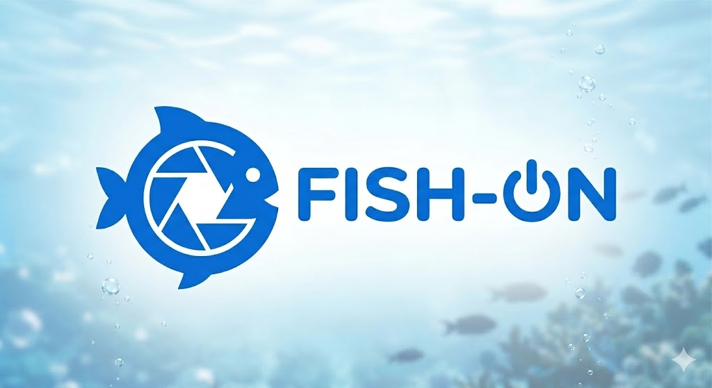

<p align="center">
  
</p>

# fish-on

Dual-camera capture system with USB relay pump control for fish behaviour research. Built with PyQt6 and OpenCV. Replaces a Bonsai Rx setup.

## Features

- **Dual camera feeds** — Top View / Side View with live preview and per-camera device selection
- **Filter pipeline** — real-time image processing with 20+ filters (blur, threshold, background subtraction, morphology, edge detection, etc.) applied to live preview and recorded video
- **Pipeline editor** — interactive drag-and-drop filter chain builder with per-filter parameter controls, shared or per-camera pipeline modes
- **Dual recording** — each camera records both raw and filtered video simultaneously (4 files per capture)
- **Dark theme** — dark QSS palette applied across the entire UI
- **Video recording** with configurable resolution, FPS (15/24/25/30/60), codec (FFV1, MJPEG, H.264), and duration
- **USB serial relay** for pump control — manual on/off, auto-timed during capture with mm:ss input and status bar countdown
- **Events CSV sidecar** — per-recording CSV logging capture start/stop and pump on/off with timestamps and frame counts
- **Config persistence** — all settings saved to `~/.fishon/config.json` and restored on launch
- **JSONL stats log** — per-recording file with session metadata and per-second fps/bitrate/write latency
- **Rotating log file** — application log at `~/.fishon/fishon.log` (5MB x 5 backups)
- **Disk space warning** — warns before recording if less than 10 GB free
- **Video prefix** — custom filename prefix for organising recordings
- **System monitoring** — CPU, RAM, and disk space in the status bar
- **Dummy mode** — synthetic camera feeds and mock relay for development without hardware

## Requirements

- Python 3.10+
- ffmpeg on PATH (for camera device name detection on Windows)
- USB webcams
- USB serial relay (4-byte protocol: `A0 01 {01|00} {checksum}`)

## Install

```
pip install -r requirements.txt
```

## Usage

```bash
# With hardware
python fishon.py

# Development mode (no cameras or relay needed)
python fishon.py --dummy
```

## Default Capture Settings

| Setting | Default |
|---------|---------|
| Duration | 05:00 |
| Resolution | 640x480 |
| FPS | 30 |
| Codec | FFV1 |
| Pump ON | 02:00 |
| Pump OFF | 04:00 |

## Output Structure

Recordings are saved to `~/FishOn/` (configurable):

```
~/FishOn/
└── prefix_20260304_143500/
    ├── prefix_top_raw.avi
    ├── prefix_top_filt.avi
    ├── prefix_side_raw.avi
    ├── prefix_side_filt.avi
    ├── prefix_events.csv
    ├── prefix_pipeline.json
    └── capture_stats.jsonl
```

The events CSV logs timestamped capture and pump events:

```csv
timestamp_ms,frame_top,frame_front,event
0,0,0,capture_start
120000,3600,3600,pump_on
240000,7200,7200,pump_off
300000,9000,9000,capture_stop
```

The stats log is JSONL — first line is session metadata, subsequent lines are per-second samples:

```jsonl
{"type": "session", "timestamp": "...", "resolution": "640x480", "fps": 30, ...}
{"time_s": 1.0, "camera": 0, "fps": 29.97, "bitrate_mbps": 12.3, "write_latency_ms": 0.8}
{"time_s": 1.0, "camera": 1, "fps": 30.01, "bitrate_mbps": 11.9, "write_latency_ms": 0.7}
```

## Filters

The pipeline editor supports filters in these categories:

| Category | Filters |
|----------|---------|
| Color | ConvertColor, BrightnessContrast, Normalize |
| Blur | GaussianBlur, MedianBlur, BilateralFilter |
| Threshold | Threshold, AdaptiveThreshold, InRange |
| Morphology | Erode, Dilate, MorphologyEx |
| Edge | Canny |
| Background | BackgroundSubtractor (MOG2/KNN) |
| ROI | CropROI, MaskROI |
| Transform | Flip, Rotate |

Pipelines can be shared across both cameras or configured independently per camera. The active pipeline config is saved alongside each recording as `prefix_pipeline.json`.

## File Overview

| File | Purpose |
|------|---------|
| `fishon.py` | Entry point, arg parsing, dark theme, rotating log setup |
| `gui.py` | PyQt6 main window, controls, events CSV, pump countdown |
| `capture.py` | Camera threads, dual video writing, device enumeration |
| `relay.py` | Serial relay control (real + mock) |
| `config.py` | JSON config persistence |
| `pipeline.py` | Filter pipeline engine and per-camera pipeline manager |
| `filters.py` | Filter registry with 20+ OpenCV-based filter implementations |
| `pipeline_editor.py` | Interactive pipeline editor dialog with drag-and-drop |
| `default_pipeline.json` | Default (empty) pipeline configuration |
| `sample_pipeline.json` | Example pipeline preset (grayscale + blur + background subtraction) |
